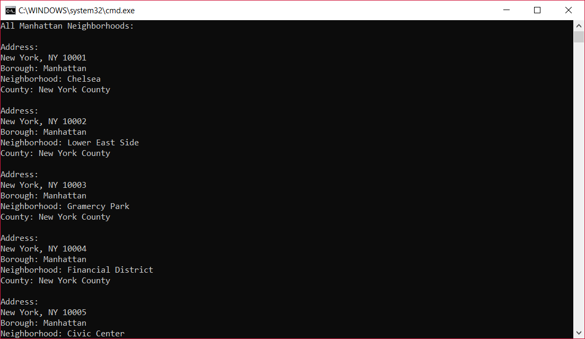
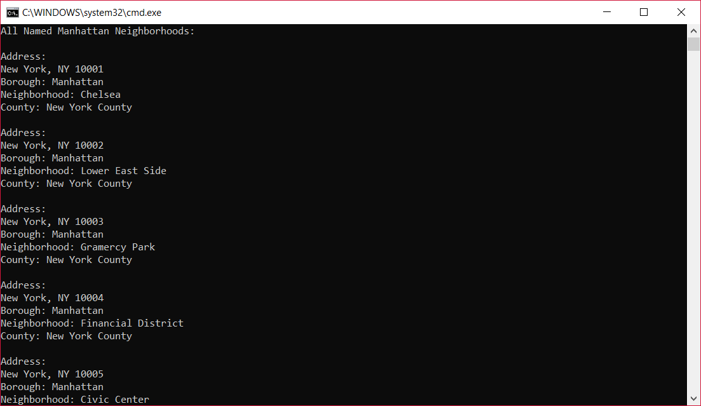
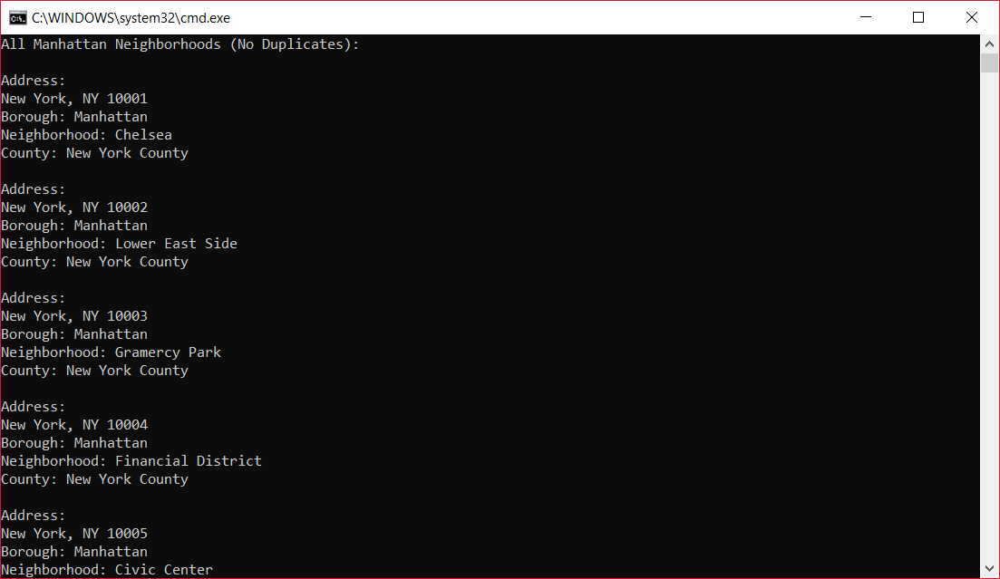

# LAB08-LINQ_in_Manhattan

## Description
Use NewtonSoft to extract all the neighborhoods of Manhattan from JSON data. Provide the user the ability to print all neighborhoods, all named neighborhoods, all non-duplicate neighborhoods, or all non-duplicate, named neighborhoods

## Instructions
- Create a JSON object (JObject) that contains all the lines of the JSON file
- Parse that JSON object. For each neighborhood in the json object, create a new Neighborhood object from the Neighborhood class, and set the properties of the object to the properties of the json neighborhood. Put each new neighborhood into a List.
- Output all of the neighborhoods in this data list
- Filter out all the neighborhoods that do not have any names
- Remove the Duplicates
- Rewrite the queries from above, and consolidate all into one single query.

## Visual
### All Neighborhoods

### All Named Neighborhoods

### All Non-Duplicate Neighborhoods

### All Non-Duplicate Named Neighborhoods

